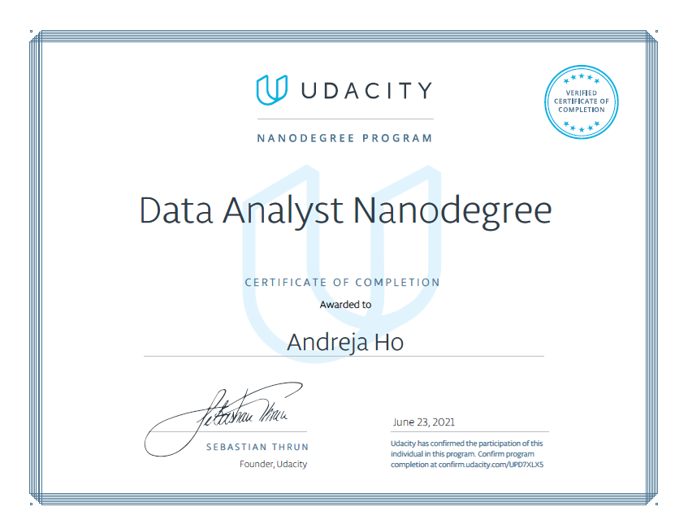

## Udacity - Data Analyst Nanodegree Program - Complete Portfolio of the Projects

This repository is dedicated to Udacity’s Data Analyst Nanodegree Program (DAND). It contains all major projects, completed in the program. Please feel free to take a look at the program [syllabus](Resources/DAND_Syllabus.pdf) and scroll through [official website](https://www.udacity.com/course/data-analyst-nanodegree--nd002), in meanwhile, I invite you to take a look at the projects, my certificate of completion, and highlights from the program.

## Data Analyst Nanodegree Certificate

 

<i>Certificate of Completion</i>

## Program Highlights
DAND program equipt me well with essential knowledge of data analysis. The lessons, case studies, and projects covered all aspects of data analysis:

- [x] Defining problem and analytical questions
- [x] Data wrangling (gathering, assessing, and cleaning data)
- [x] EDA and feature engineering
- [x] Testing and concluding from descriptive & inferential statistics
- [x] Data visualization and communication

Additionally, I enjoyed the emphasis on Python libraries such as **Pandas**, **NumPy**, **Matpolotlib**, and **Seaborn**. I was most impressed with the **statistical topics** such as **Binominal Distribution**, **Conditional Probability**, **Bayes Rule**, **Hypothesis Testing**, **Regression**, and **A/B testing**. The lesson also covered **VIFs (variance inflation factors)**, **full rank models** and **higher-order interactions in regression models**. Essential knowledge for a deep understanding of data analysis and data science! I also love the complex approach to the **bivariate** and **multivariate visualization**s with Python, Pandas, Matplotlib, and Seaborn.

## Projects

Please find the summaries for each of the main projects that I have completed in the (DAND) Program in the section below. Each individual summary contains project highlights and links to the project’s repository and submission review.

### 🎯 [Project 1 - Explore Weather Trends](https://github.com/AndrejaCH/Weather_Trends)

In this project, I am analyzing the global temperature data and temperature data from Ljubljana and Helsinki over time. The highlights for this project are ***calculating moving average** with ***Python*** and ***Excel*** on time series data, ***creating visuals*** and ***calculating & interpreting correlations*** between variables. The project yielded a comprehensive report that includes all steps of data analysis with an explanation of the code, terminology and findings.

Go to [Project 1 - Explore Weather Trends](https://github.com/AndrejaCH/Weather_Trends) Repository. 
✔[Submission_Review](Submission_Reviews/01_Project_Weather_Trends_Submission_Review.pdf)

### 🎯 [Project  2 - Investigate a Dataset](https://github.com/AndrejaCH/Data_Investigation)

In this project, I am investigating datasets about suicide rate, GDP and Gini-Index, retrieved from *Gapminder*. The focus of this project is a thorough data investigation to discover hidden trends and find clues that could potentially lead to interesting findings. The highlights are the use of ***Python query*** and ***groupby*** functions, merging and reshape data with Python ***melt*** and ***merge*** function, creating ***EDA visuals*** and ***calculating & interpreting correlations*** between variables and finding interesting facts about suicide, DGP and Gini-Index.

Go to [Project  2 - Investigate a Dataset](https://github.com/AndrejaCH/Data_Investigation) Repository. 
✔[Submission_Review](Submission_Reviews/02_Investigate_a_Dataset_Submission_Review.pdf)

### 🎯 [Project 3 - Analyze A/B Test Results](https://github.com/AndrejaCH/AB_Testing)

In this project, I am performing A/B testing for the company’s new website. I performed hypothesis testing with Python and NumPy to determine p-value and used regression models to advise if the company should launch a new website. The result is robust statistical analysis and interpretation of results to ensure the right decision for the company. The highlights of this project are interpretations of ***p-value***, ***z-score*** and ***critical value***, use of ***full rank models***, ***VIF*** and ***higher-order interactions in regression models***.

Go to [Project 3 - Analyze A/B Test Result](https://github.com/AndrejaCH/AB_Testing) Repository. 
✔[Submission_Review](Submission_Reviews/03_Analyze_AB_Test_Results_Submission_Review.pdf)

### 🎯 [Project 4 - Wrangle and Analyze Data](https://github.com/AndrejaCH/Wrangle_And_Analyze)

In this project, I am working with data from Twitter and it’s all about our best friends - dogs! The main focus of this project is ***data-wrangling*** - retrieving data from various sources and formats such as ***Tweeter API***, ***JSON file***, and ***tsv file***, assessing data and cleaning data. The highlight of this project is working with various sources and files and clean the data using the define-code-test approach. The project yields a clean main dataset that is ready for further analysis. 

Go to [Project 4 - Wrangle and Analyze Data](https://github.com/AndrejaCH/Wrangle_And_Analyze) Repository. 
✔[Submission_Review](Submission_Reviews/04_Wrangle_and_Analyze_Submission_Review.pdf)

### 🎯 [Project 5 - Communicate Data Findings - Exploratory and Explanatory Data Analysis](https://github.com/AndrejaCH/Exploratory_and_Explanatory_Visualizations)

In this project, I am working with a complex dataset PISA 2012 (survey of students' skills and knowledge as they approach the end of compulsory education). The main focus of this project is to create ***univariate***, ***bivariate***, and ***multivariate visualizations*** with Python libraries ***Matplotlib*** and ***Seaborn***. The highlight of this project is to work with a complex dataset and to build a clear understanding of its variables by reading through the dataset’s dictionary and codebook. The project yielded a reduced dataset that focuses on only points of interest and creating visualizations that follow good design principles.

Go to [Project 5 - Communicate Data Findings](https://github.com/AndrejaCH/Exploratory_and_Explanatory_Visualizations) Repository. 
✔[Submission_Review](Submission_Reviews/05_Communicate_Data_Findings_Submission_Review.pdf)

